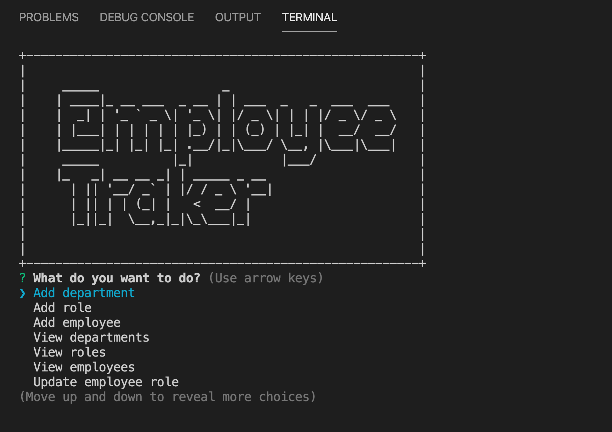
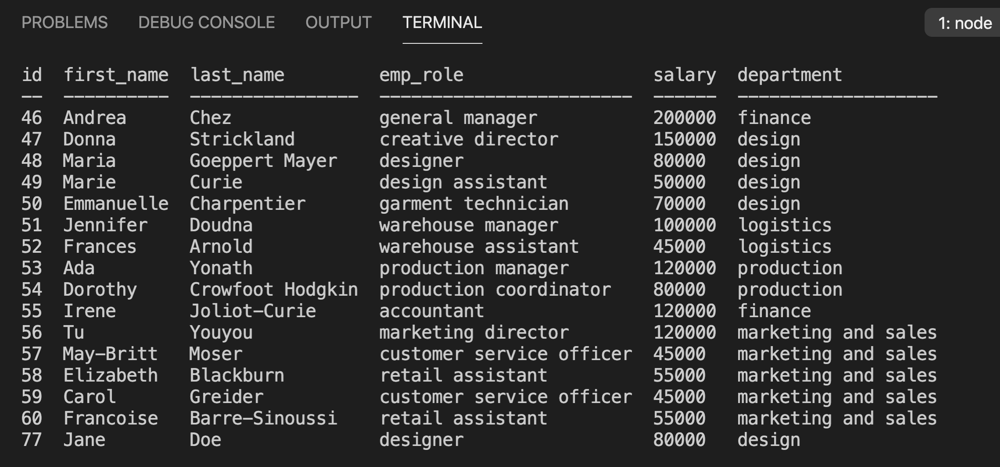
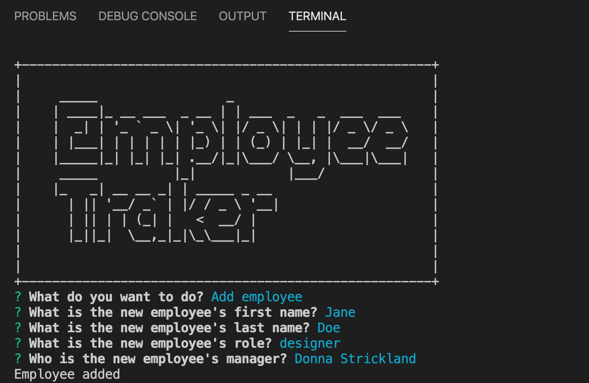
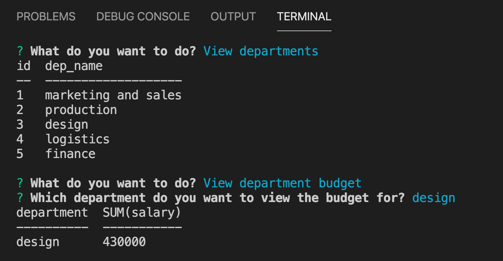

# Employee Tracker

  ## Description
  

  Keep track of your employees, their roles and your company's budget with this employee management app.

Usage video :link: 

Github repository :link: https://github.com/avpizarro/employeeTracker.git
  
  

  

  

  

  ## Table of Contents

  * [Installation](#installation)
  * [Usage](#usage)
  * [License](#license)
  * [Questions](#questions)

  ## Installation
  Use the node employeeTracker,js command to initialise but first set up your database with the employeeTracker.sql file.

  ## Usage

  Choose the action you want to perform, you will be prompted to enter your search paramenters. You can choose to view, add or delete employees, roles or departments, you can also update employee's data or view what the budget is for each department.

  ## License
  This Source Code Form is subject to the terms of the MIT License. 
  If a copy of the License was not distributed with this file, You can obtain one at https://opensource.org/licenses

  ## Questions
  For further information please visit my GitHub page:
  https://github.com/avpizarro

  Or email me directly :e-mail: avpizarro@live.com
  